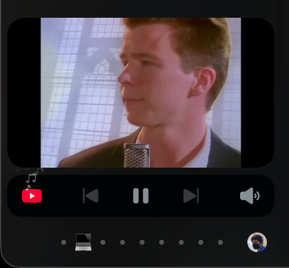

# Zenslop

> A [Zen Browser](https://zen-browser.app/) mod that mirrors the currently playing video into the sidebar, anchored above the media controls.

<!-- HERO IMAGE — full-width screenshot of the sidebar with a video mirrored above the media controls -->
<p align="center">
  
</p>

---

## What it does

Zen's sidebar already surfaces a media controls strip whenever a tab is playing audio or video. This mod hooks into that strip and renders a live, low-latency mirror of the actual video frame directly above it — so you can keep an eye on what's playing without leaving the current tab or opening a separate PiP window.

- Mirrors the active `<video>` element from any tab into the sidebar.
- Anchors to Zen's media controls and tracks them through hover, popup, and animation states.
- Aspect-aware: vertical sources stay centered and proportional, landscape fills the player width.
- Toggle button (eye / eye-off) injected next to the existing PiP button so you can hide the mirror without stopping playback.
- Pads the tab list so your last tabs can still scroll into view above the floating video.

<!-- DEMO GIF — short loop of starting playback in a tab and the mirror appearing in the sidebar -->
<p align="center">
  
</p>

---

## How it works

The mod runs in three pieces that bridge Firefox's e10s process boundary:

| File | Process | Responsibility |
| --- | --- | --- |
| `main.uc.js` | chrome | Injects the floating video container into the sidebar, registers the `JSWindowActor`, and exposes `window.ZenPiPController`. |
| `content-actor.js` | content | Watches `playing` / `pause` / `volumechange` on `<video>` elements, captures the stream via `captureStream()`, and forwards it through a same-process `RTCPeerConnection`. |
| `parent-actor.js` | chrome | Receives the WebRTC offer, answers it, and hands the resulting `MediaStream` to `ZenPiPController.showVideo()`. |

<!-- ARCHITECTURE DIAGRAM — boxes for content actor → WebRTC loopback → parent actor → sidebar UI -->
<p align="center">
  
</p>

### Why WebRTC for a same-browser mirror?

`captureStream()` produces a `MediaStream` bound to the content process. Chrome-process UI can't consume it directly, and `postMessage` can't ferry live media. A loopback `RTCPeerConnection` between the two actors is the cheapest way to move frames across the process boundary without copying pixels through JS.

The connection is tuned for "this is loopback, stop pretending it's the open internet":

- `minBitrate: 2.5 Mbps`, `priority: "high"`, `networkPriority: "high"` on the sender so the encoder doesn't slow-start.
- `degradationPreference: "maintain-framerate"` so dropped pixels are preferred over dropped frames.
- `receiver.playoutDelayHint = 0`, `receiver.jitterBufferTarget = 0` so frames render as they arrive instead of buffering up over the first few seconds.

---

## Installation

> [!NOTE]
> This mod is loaded through [Sine](https://github.com/CosmoCreeper/Sine), Zen's userscript loader. If you're loading user-chrome scripts via a different mechanism, adjust the install path accordingly.

1. Clone or download this repo into your Sine mods directory:
   ```sh
   cd "$ZEN_PROFILE/chrome/sine-mods"
   git clone https://github.com/<you>/PIP-Customizations.git "PIP Customizations"
   ```
2. Restart Zen.
3. Play a video in any tab — the mirror appears above the sidebar media controls.

<!-- INSTALL SCREENSHOT — file tree of the sine-mods directory with this folder dropped in -->
<p align="center">
  
</p>

---

## Usage

| Action | Result |
| --- | --- |
| Play a video in any tab | Mirror appears above the sidebar media controls. |
| Click the eye icon next to the PiP button | Toggle the mirror visibility without stopping playback. |
| Mute the source video | Mirror hides (mute is treated as the "this is an ad" signal). |
| Pause / close the source tab | Mirror animates out and the stream is released. |

<!-- TOGGLE SCREENSHOT — close-up of the media controls with the eye-toggle button highlighted -->
<p align="center">
  
</p>

---

## Configuration

Tunables live at the top of `main.uc.js` in the `CONFIG` block:

```js
const CONFIG = Object.freeze({
  GAP: 6,                       // px between video bottom and media controls top
  ANIM_MS: 220,                 // entrance / exit animation duration
  ANIM_TAIL_MS: 350,            // keep ticking through animations after a state change
  ELEVATED_HOLD_MS: 180,        // hold elevated top through brief glitch frames
  MAX_HEIGHT: 600,              // cap so vertical sources don't take over the sidebar
  DEFAULT_ASPECT: 16 / 9,
  PIP_OPEN_DEBOUNCE_MS: 1500,
  PIP_OBSERVE_TIMEOUT_MS: 3000,
});
```

Encoder caps live in `content-actor.js`:

```js
const MAX_BITRATE_BPS = 8_000_000;
const MIN_BITRATE_BPS = 2_500_000;
const MAX_FRAMERATE = 60;
```

---

## Compatibility

- Built against **Zen Browser** (Firefox-based, ESR rapid channel).
- Uses `JSWindowActor`, `RTCPeerConnection`, `HTMLMediaElement.captureStream()`, `RTCRtpReceiver.playoutDelayHint`, `RTCRtpReceiver.jitterBufferTarget`. Older Firefox builds will silently ignore the receiver hints and the encoder `minBitrate`.
- macOS-tested. Nothing platform-specific should remain.

---

## Troubleshooting

<details>
<summary><strong>Nothing shows up in the sidebar.</strong></summary>

Open the Browser Toolbox (`Cmd+Opt+Shift+I` on macOS) and check the chrome-process console for `[ZenPiP]` log lines.

- `Could not find the music player UI.` — Zen has changed the selector for the media controls toolbar. Update `MUSIC_PLAYER_SELECTORS` in `main.uc.js`.
- `Failed to register JSWindowActor` — the `resource://` substitution didn't resolve. Check that the mod folder is exactly named `PIP Customizations` inside `chrome/sine-mods`.
</details>

<details>
<summary><strong>The mirror is offset / jumps when the controls expand.</strong></summary>

`ELEVATED_HOLD_MS` controls how long the mod holds the elevated top through brief glitch frames where Zen's expanded popup hasn't laid out yet. Bump it up if you see flicker.
</details>

<details>
<summary><strong>The mirror appears but framerate is choppy for the first few seconds.</strong></summary>

Confirm your Firefox build supports `RTCRtpReceiver.jitterBufferTarget` and `playoutDelayHint`. Without them the receiver's adaptive jitter buffer ramps up over the first ~3 seconds.
</details>

---

## License

<!-- TODO: pick a license — MIT is the usual default for Zen mods -->
TBD.

---

## Credits

- Built on top of [Zen Browser](https://zen-browser.app/)'s sidebar architecture.
- Loaded via [Sine](https://github.com/CosmoCreeper/Sine).
