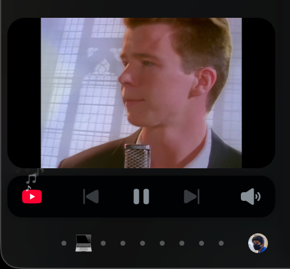
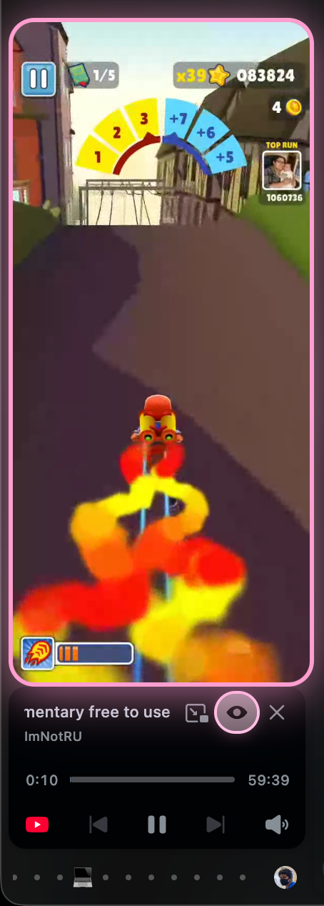

# Zenslop

A [Sine](https://github.com/CosmoCreeper/Sine) mod for [Zen Browser](https://zen-browser.app/) that mirrors the currently playing video into the sidebar, anchored above the media controls.

<!-- HERO IMAGE — full-width screenshot of the sidebar with a video mirrored above the media controls -->
<p align="center">
  
</p>

---

## What it does

This mod hooks into the existing media playback controls and surfaces the video directly above it - so you can continue the doomscroll without dealing with adjusting the position of a separate PiP window or hiding the video altogether.

<!-- DEMO GIF — short loop of starting playback in a tab and the mirror appearing in the sidebar -->
<p align="center">
  
</p>

---

## Installation

> [!NOTE]
> This mod is loaded through [Sine](https://github.com/CosmoCreeper/Sine), Zen's userscript loader. If you're loading user-chrome scripts via a different mechanism, just add this to your chrome folder like you would with other sine mods. 
> 
> Additionally, this mod requires installing Javascript to work, which is disabled by default for unofficial sources in Sine. If you would like to audit the project for malicious code, you can look at the source code in this repository.

1. Visit [about:settings](about:settings) and go to the "Sine Mods" section
2. Click the Settings icon to the right of the Install button, and turn on "Enable installing JS from unofficial sources. (unsafe, use at your own risk)" (see note above if hesitant)
3. Enter `Firebolt9907/Zenslop` into the text input box right under "or, add your own locally from a GitHub repo." and click Install
4. Restart your browser (important!!)

---

## Featured Forks

### Kawaiislop
**bboonstra/Kawaiislop/tree/bugfix**

<p align="center">
  
</p>

### Contact me if you want to add your fork here

---

## The Technical Stuff

The mod bridges Firefox's process boundary with source actors and a native receiver:

| File | Process | Responsibility |
| --- | --- | --- |
| `main.uc.js` | chrome | Positions the preview, creates a receiver in the source process, and manages native startup and canvas fallback. |
| `content-actor.sys.mjs` | content | Discovers videos, supplies an exact video reference, mirrors captions, and captures fallback frames. |
| `parent-actor.sys.mjs` | chrome | Forwards source state and captions and runs the adaptive fallback frame clock. |
| `native-actor.sys.mjs` | content | Calls Firefox's privileged `cloneElementVisually()` API in the sidebar receiver. |

The source video lives in a content process, while the sidebar UI lives in
chrome. By default, the mod embeds a remote browser in the sidebar in the
source's process and clones already-decoded video into its receiver. Actors
carry setup, control, and caption messages; native playback does not send
per-frame RGBA buffers to chrome or create a second video decoder.

Canvas remains available when native startup fails, the source already has a
PiP clone, or an isolated iframe cannot share the receiver process. Canvas
capture is self-clocking, resolution-adaptive, and capped to the rendered
sidebar size. Its default is 15 fps. Native playback follows the source frame
rate; canvas quality and frame-rate settings apply only to canvas.

The receiver is released when the preview hides, the source returns to view,
or the browser window becomes inactive. Source playback and audio remain under
the page's control. Native cloning is a browser-internal API, so fallback is
retained for compatibility. Battery savings have not been measured.


---

## Usage

| Action | Result |
| --- | --- |
| Play a video in any tab | Mirror appears above the sidebar media controls. |
| Click the eye icon next to the PiP button | Toggle the mirror visibility without stopping playback. |
| Mute the source video | Mirror hides (mute is treated as the "this is an ad" signal). |
| Pause / close the source tab | Mirror animates out and the stream is released. |

The **Captions** mod setting follows the caption state in the YouTube player by
default. It can also keep captions always on or turn them off entirely.
Enable **Show Captions When PiP Is Hidden** to keep the caption panel visible
when the sidebar PiP eye toggle is off.

<!-- TOGGLE SCREENSHOT — close-up of the media controls with the eye-toggle button highlighted -->
<p align="center">
  
</p>

---

## Configuration

Choose **Video Renderer** in the mod settings: **Native PiP (automatic fallback)**
is the default; **Canvas (low frame rate)** forces the existing renderer.
After updating, restart Zen so it loads the new receiver actor module.

Tunables live at the top of `main.uc.js` in the `CONFIG` block:

```js
const CONFIG = Object.freeze({
  GAP: 6,                       // px between video bottom and media controls top
  ANIM_MS: 220,                 // entrance / exit animation duration
  LAYOUT_ANIM_MS: 180,          // smooth caption-driven PiP movement / resizing
  CAPTION_ANIM_MS: 180,         // caption scale / fade duration
  CAPTION_GAP_GRACE_MS: 1000,   // hold through short gaps between caption cues
  ANIM_TAIL_MS: 350,            // keep ticking through animations after a state change
  ELEVATED_HOLD_MS: 180,        // hold elevated top through brief glitch frames
  MAX_HEIGHT: 600,              // cap so vertical sources don't take over the sidebar
  DEFAULT_ASPECT: 16 / 9,
  PIP_OPEN_DEBOUNCE_MS: 1500,
  PIP_OBSERVE_TIMEOUT_MS: 3000,
});
```

The base capture cap lives in `content-actor.sys.mjs`:

```js
const MAX_FRAME_DIMENSION = 480;
```

---

## Compatibility

- Built against **Zen Browser** (Firefox-based, ESR rapid channel).
- Uses `JSWindowActor`, `OffscreenCanvas`, and cross-process pixel buffers.
- Tested with YT and YTM on MacOS, but there shouldn't be anything OS specific

The sidebar layout supports Zen 1.23b's Library hover stack. Tab-space
reservation targets the inner tab viewport rather than `#tabbrowser-tabs`,
which would move the playback controls and create a shrinking feedback loop.
While recent downloads are open, the preview anchors above that overlay.

---

## Troubleshooting

<details>
<summary><strong>Nothing shows up in the sidebar.</strong></summary>

Open the Browser Toolbox (`Cmd+Opt+Shift+I` on macOS) and check the chrome-process console for `[ZenPiP]` log lines.

- `Could not find the music player UI.` — Zen has changed the selector for the media controls toolbar. Update `MUSIC_PLAYER_SELECTORS` in `main.uc.js`.
- `Failed to register JSWindowActor` — the `resource://` substitution didn't resolve. Check that the mod folder is exactly named `Zenslop` inside `chrome/sine-mods`.
</details>

<details>
<summary><strong>The mirror is offset / jumps when the controls expand.</strong></summary>

Update the mod and restart Zen if showing the preview pulls the playback
controls towards the address bar and hiding it restores them. Older versions
selected the outer tab strip instead of the inner viewport when reserving
space. `ELEVATED_HOLD_MS` handles brief hover-layout glitches; increasing it
does not fix that selector bug.
</details>

<details>
<summary><strong>The mirror appears but framerate is choppy for the first few seconds.</strong></summary>

Run `window.ZenPiPController.diagnostics()` in the chrome-process Browser Toolbox.
It reports `renderer`, `nativeStarting`, and `fallbackReason`. Canvas stays
visible during startup and is removed only after native presentation is
confirmed. Completely black video may fail that check on builds without native
presentation counters and stay on canvas. To retry a failed native source,
toggle Video Renderer to Canvas and back to Native PiP.
</details>

---

Regression checks: `node --test tests/*.test.mjs`. These use mocked Gecko objects;
real process placement, presentation, and power use must be checked in Zen.

## License

The MIT License (MIT)

Copyright (c) 2026 Rishu Sharma

Permission is hereby granted, free of charge, to any person obtaining a copy of this software and associated documentation files (the "Software"), to deal in the Software without restriction, including without limitation the rights to use, copy, modify, merge, publish, distribute, sublicense, and/or sell copies of the Software, and to permit persons to whom the Software is furnished to do so, subject to the following conditions:

The above copyright notice and this permission notice shall be included in all copies or substantial portions of the Software.

THE SOFTWARE IS PROVIDED "AS IS", WITHOUT WARRANTY OF ANY KIND, EXPRESS OR IMPLIED, INCLUDING BUT NOT LIMITED TO THE WARRANTIES OF MERCHANTABILITY, FITNESS FOR A PARTICULAR PURPOSE AND NONINFRINGEMENT. IN NO EVENT SHALL THE AUTHORS OR COPYRIGHT HOLDERS BE LIABLE FOR ANY CLAIM, DAMAGES OR OTHER LIABILITY, WHETHER IN AN ACTION OF CONTRACT, TORT OR OTHERWISE, ARISING FROM, OUT OF OR IN CONNECTION WITH THE SOFTWARE OR THE USE OR OTHER DEALINGS IN THE SOFTWARE.

---

## Credits

- [Zen Browser](https://zen-browser.app/)
- [Sine](https://github.com/CosmoCreeper/Sine)
